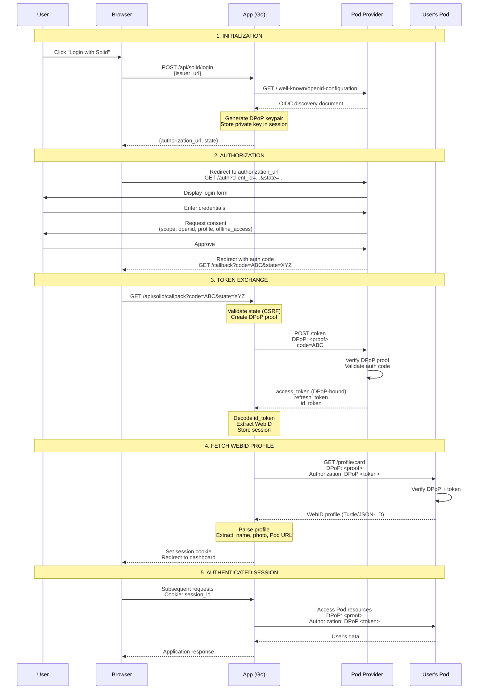

# Solid Authentication Research & Implementation Guide

**Issue:** #46
**Phase:** Phase 1.2 - Foundation & Research
**Status:** ✅ Complete
**Dependencies:** #45 (Dev environment setup)

---

## Table of Contents

1. [Overview](#overview)
2. [Solid OIDC Specification](#solid-oidc-specification)
3. [DPoP (Demonstrating Proof-of-Possession)](#dpop-demonstrating-proof-of-possession)
4. [Complete Authentication Flow](#complete-authentication-flow)
5. [WebID Profile Structure](#webid-profile-structure)
6. [Library Comparison](#library-comparison)
7. [Implementation Decision](#implementation-decision)
8. [Security Considerations](#security-considerations)
9. [Testing Strategy](#testing-strategy)
10. [Resources](#resources)

---

## Overview

Solid authentication uses **OpenID Connect (OIDC)** enhanced with **DPoP (Demonstrating Proof-of-Possession)** tokens to provide secure, decentralized authentication without storing passwords centrally.

### Key Concepts

- **WebID**: A URI that identifies a person, serves as their identity
- **OIDC**: OAuth 2.0-based authentication protocol
- **DPoP**: Proof-of-possession mechanism for tokens (prevents token theft)
- **Solid Pod Provider**: Issues OIDC tokens and hosts user's Pod
- **Resource Server**: The application accessing user's Pod (our app)

### Why Solid OIDC + DPoP?

| Feature | Traditional OAuth | Solid OIDC + DPoP |
|---------|------------------|-------------------|
| User owns identity | ❌ Platform-specific | ✅ WebID (portable) |
| Token theft protection | ⚠️ Bearer tokens | ✅ Cryptographic proof |
| Decentralized | ❌ Central authority | ✅ Multiple providers |
| Data ownership | ❌ Platform controls | ✅ User controls |
| Works offline | ❌ No | ✅ Yes (with cache) |

---

## Solid OIDC Specification

### OIDC Primer

OpenID Connect is built on OAuth 2.0 and adds:
- **ID Token**: JWT containing user identity claims
- **UserInfo Endpoint**: Additional user profile data
- **Discovery**: `.well-known/openid-configuration` metadata

### Solid OIDC Extensions

Solid extends standard OIDC with:

1. **WebID as subject** - `sub` claim is user's WebID URI
2. **DPoP requirement** - Tokens must be bound to keypair
3. **Dynamic Client Registration** - Apps register on-the-fly
4. **Solid-specific claims** - Pod URL, storage location

### OIDC Discovery Document

Every Solid provider exposes OIDC configuration at:
```
https://[provider]/.well-known/openid-configuration
```

**Example for SolidCommunity.net:**
```json
{
  "issuer": "https://solidcommunity.net",
  "authorization_endpoint": "https://solidcommunity.net/.oidc/auth",
  "token_endpoint": "https://solidcommunity.net/.oidc/token",
  "jwks_uri": "https://solidcommunity.net/.oidc/jwks",
  "registration_endpoint": "https://solidcommunity.net/.oidc/register",
  "userinfo_endpoint": "https://solidcommunity.net/.oidc/me",
  "response_types_supported": ["code", "code id_token", "id_token code"],
  "grant_types_supported": ["authorization_code", "refresh_token"],
  "subject_types_supported": ["public"],
  "id_token_signing_alg_values_supported": ["RS256"],
  "token_endpoint_auth_methods_supported": ["client_secret_basic"],
  "dpop_signing_alg_values_supported": ["RS256", "ES256"],
  "solid_oidc_supported": "https://solidproject.org/TR/solid-oidc"
}
```

**Key Fields for Implementation:**
- `authorization_endpoint` - Where to redirect user for login
- `token_endpoint` - Where to exchange code for tokens
- `jwks_uri` - Public keys for token verification
- `dpop_signing_alg_values_supported` - DPoP algorithms

---

## DPoP (Demonstrating Proof-of-Possession)

### What is DPoP?

DPoP binds access tokens to a cryptographic key pair, preventing token theft and replay attacks.

**RFC 9449:** https://datatracker.ietf.org/doc/html/rfc9449

### How DPoP Works

```
┌─────────────────────────────────────────────────────────┐
│ Client generates key pair (public + private)            │
│ Private key NEVER leaves client                          │
└─────────────────────────────────────────────────────────┘
                      │
                      ▼
┌─────────────────────────────────────────────────────────┐
│ Client creates DPoP proof (signed JWT)                   │
│ - Contains: public key, HTTP method, URL, timestamp      │
│ - Signed with private key                                │
└─────────────────────────────────────────────────────────┘
                      │
                      ▼
┌─────────────────────────────────────────────────────────┐
│ Client sends DPoP proof + access token in request        │
│ Header: DPoP: <proof-jwt>                                │
│ Header: Authorization: DPoP <access-token>               │
└─────────────────────────────────────────────────────────┘
                      │
                      ▼
┌─────────────────────────────────────────────────────────┐
│ Server verifies:                                          │
│ 1. DPoP proof signature (using public key in proof)      │
│ 2. Access token bound to same public key                 │
│ 3. HTTP method + URL match request                       │
│ 4. Timestamp is recent (prevents replay)                 │
└─────────────────────────────────────────────────────────┘
```

### DPoP Proof JWT Structure

**Header:**
```json
{
  "typ": "dpop+jwt",
  "alg": "RS256",
  "jwk": {
    "kty": "RSA",
    "n": "0vx7agoebGcQSuuPiLJXZptN9nndrQmbXEps2...",
    "e": "AQAB"
  }
}
```

**Payload:**
```json
{
  "jti": "unique-identifier-12345",
  "htm": "POST",
  "htu": "https://solidcommunity.net/.oidc/token",
  "iat": 1700000000
}
```

**Claims:**
- `jti` - Unique identifier (prevents replay)
- `htm` - HTTP method (GET, POST, etc.)
- `htu` - HTTP URI (target URL)
- `iat` - Issued at timestamp
- `jwk` - Public key (in header)

### DPoP in Action

**1. Token Request (with DPoP)**
```http
POST /token HTTP/1.1
Host: solidcommunity.net
Content-Type: application/x-www-form-urlencoded
DPoP: eyJ0eXAiOiJkcG9wK2p3dCIsImFsZyI6IlJTMjU2IiwiandrIjp7Imt0eSI6...

grant_type=authorization_code&
code=AUTH_CODE_HERE&
redirect_uri=https://notspies.org/api/solid/callback&
client_id=2f585e37-e435-41b8-b9bf-9d338a1b945a
```

**2. Token Response (DPoP-bound)**
```json
{
  "access_token": "eyJhbGciOiJSUzI1NiIsInR5cCI6ImF0K2p3dCJ9...",
  "token_type": "DPoP",
  "expires_in": 3600,
  "refresh_token": "eyJhbGciOiJSUzI1NiIsInR5cCI6InJlZnJlc2hfand0In0...",
  "id_token": "eyJhbGciOiJSUzI1NiIsInR5cCI6IkpXVCJ9..."
}
```

**3. Resource Request (with DPoP)**
```http
GET /private/location-tracker/locations/ HTTP/1.1
Host: alice.solidcommunity.net
Authorization: DPoP eyJhbGciOiJSUzI1NiIsInR5cCI6ImF0K2p3dCJ9...
DPoP: eyJ0eXAiOiJkcG9wK2p3dCIsImFsZyI6IlJTMjU2IiwiandrIjp7Imt0eSI6...
```

**Why This Matters:**
- Even if `access_token` is stolen, attacker can't use it without private key
- Each request requires new DPoP proof with current timestamp
- Replay attacks prevented by `jti` (JWT ID) tracking

---

## Complete Authentication Flow

### Sequence Diagram



### Detailed Flow Steps

#### Step 1: Login Initiation

**Client Action:**
```javascript
// User clicks "Login with Solid"
const issuerUrl = "https://solidcommunity.net";

fetch('/api/solid/login', {
  method: 'POST',
  headers: { 'Content-Type': 'application/json' },
  body: JSON.stringify({ issuer_url: issuerUrl })
});
```

**Server Action (Go):**
```go
func handleSolidLogin(w http.ResponseWriter, r *http.Request) {
    // 1. Parse request
    var req struct {
        IssuerURL string `json:"issuer_url"`
    }
    json.NewDecoder(r.Body).Decode(&req)

    // 2. Discover OIDC configuration
    oidcConfig := discoverOIDCConfiguration(req.IssuerURL)

    // 3. Generate DPoP keypair
    privateKey, publicKey := generateDPoPKeyPair()

    // 4. Generate CSRF state
    state := generateRandomString(32)

    // 5. Store state + private key in session
    storeOIDCState(state, privateKey)

    // 6. Build authorization URL
    authURL := fmt.Sprintf("%s?client_id=%s&redirect_uri=%s&response_type=code&scope=openid+profile+offline_access&state=%s",
        oidcConfig.AuthorizationEndpoint,
        clientID,
        redirectURI,
        state)

    // 7. Return to client
    json.NewEncoder(w).Encode(map[string]string{
        "authorization_url": authURL,
        "state": state,
    })
}
```

#### Step 2: User Authorization

**Browser redirects to:**
```
https://solidcommunity.net/.oidc/auth?
  client_id=2f585e37-e435-41b8-b9bf-9d338a1b945a&
  redirect_uri=https://notspies.org/api/solid/callback&
  response_type=code&
  scope=openid+profile+offline_access&
  state=LvL-Iyrj_n_tpEzttwO8HfnW23F8gxSy
```

**User actions:**
1. Enters username/password
2. Reviews requested permissions
3. Clicks "Allow"

**Provider redirects back:**
```
https://notspies.org/api/solid/callback?
  code=AUTH_CODE_12345&
  state=LvL-Iyrj_n_tpEzttwO8HfnW23F8gxSy
```

#### Step 3: Token Exchange

**Server Action (Go):**
```go
func handleSolidCallback(w http.ResponseWriter, r *http.Request) {
    // 1. Extract parameters
    code := r.URL.Query().Get("code")
    state := r.URL.Query().Get("state")

    // 2. Validate state (CSRF protection)
    privateKey, valid := validateAndGetOIDCState(state)
    if !valid {
        http.Error(w, "Invalid state", 401)
        return
    }

    // 3. Create DPoP proof for token request
    dpopProof := createDPoPProof(privateKey, "POST", tokenEndpoint)

    // 4. Exchange code for tokens
    req := &http.Request{
        Method: "POST",
        URL: tokenEndpoint,
        Header: http.Header{
            "Content-Type": {"application/x-www-form-urlencoded"},
            "DPoP": {dpopProof},
        },
        Body: buildTokenRequestBody(code, clientID, redirectURI),
    }

    resp := httpClient.Do(req)

    // 5. Parse token response
    var tokens struct {
        AccessToken  string `json:"access_token"`
        TokenType    string `json:"token_type"` // "DPoP"
        RefreshToken string `json:"refresh_token"`
        IDToken      string `json:"id_token"`
        ExpiresIn    int    `json:"expires_in"`
    }
    json.NewDecoder(resp.Body).Decode(&tokens)

    // 6. Verify and decode ID token
    claims := verifyAndDecodeIDToken(tokens.IDToken)
    webID := claims["sub"].(string)

    // 7. Store session
    sessionID := generateSessionID()
    storeSession(sessionID, &SolidSession{
        WebID:        webID,
        AccessToken:  tokens.AccessToken,
        RefreshToken: tokens.RefreshToken,
        ExpiresAt:    time.Now().Add(time.Duration(tokens.ExpiresIn) * time.Second),
        DPoPPrivateKey: privateKey,
    })

    // 8. Set session cookie
    http.SetCookie(w, &http.Cookie{
        Name:     "solid_session",
        Value:    sessionID,
        HttpOnly: true,
        Secure:   true,
        SameSite: http.SameSiteLaxMode,
    })

    // 9. Redirect to app
    http.Redirect(w, r, "/?solid=success", 302)
}
```

#### Step 4: Fetch WebID Profile

**Server Action (Go):**
```go
func fetchWebIDProfile(webID string, accessToken string, privateKey crypto.PrivateKey) (*WebIDProfile, error) {
    // 1. Parse WebID URL
    profileURL, err := url.Parse(webID)
    if err != nil {
        return nil, err
    }

    // 2. Create DPoP proof for profile request
    dpopProof := createDPoPProof(privateKey, "GET", profileURL.String())

    // 3. Make authenticated request to Pod
    req, _ := http.NewRequest("GET", profileURL.String(), nil)
    req.Header.Set("Authorization", "DPoP "+accessToken)
    req.Header.Set("DPoP", dpopProof)
    req.Header.Set("Accept", "text/turtle, application/ld+json")

    resp, err := httpClient.Do(req)
    if err != nil {
        return nil, err
    }
    defer resp.Body.Close()

    // 4. Parse profile (Turtle or JSON-LD)
    profile, err := parseWebIDProfile(resp.Body, resp.Header.Get("Content-Type"))
    if err != nil {
        return nil, err
    }

    return profile, nil
}
```

#### Step 5: Authenticated Requests

**Every subsequent request to Pod:**
```go
func makePodRequest(session *SolidSession, method, url string, body io.Reader) (*http.Response, error) {
    // 1. Check token expiry
    if time.Now().After(session.ExpiresAt) {
        // Refresh token
        session = refreshAccessToken(session)
    }

    // 2. Create DPoP proof
    dpopProof := createDPoPProof(session.DPoPPrivateKey, method, url)

    // 3. Make request
    req, _ := http.NewRequest(method, url, body)
    req.Header.Set("Authorization", "DPoP "+session.AccessToken)
    req.Header.Set("DPoP", dpopProof)

    return httpClient.Do(req)
}
```

---

## WebID Profile Structure

### What is a WebID?

A WebID is a **HTTP URI** that identifies a person and points to their profile document.

**Example:** `https://alice.solidcommunity.net/profile/card#me`

### WebID Profile Document (Turtle)

```turtle
@prefix foaf: <http://xmlns.com/foaf/0.1/> .
@prefix solid: <http://www.w3.org/ns/solid/terms#> .
@prefix pim: <http://www.w3.org/ns/pim/space#> .
@prefix acl: <http://www.w3.org/ns/auth/acl#> .
@prefix schema: <http://schema.org/> .

<#me>
    a foaf:Person, schema:Person ;

    # Basic Identity
    foaf:name "Alice Smith" ;
    foaf:nick "alice" ;
    foaf:mbox <mailto:alice@example.com> ;
    foaf:img <https://alice.solidcommunity.net/profile/photo.jpg> ;
    foaf:homepage <https://alice.example.com> ;

    # Solid-specific
    solid:oidcIssuer <https://solidcommunity.net> ;
    pim:storage <https://alice.solidcommunity.net/> ;
    acl:trustedApp [
        acl:origin <https://notspies.org> ;
        acl:mode acl:Read, acl:Write ;
    ] ;

    # Social
    foaf:knows <https://bob.solidcommunity.net/profile/card#me> ;
    foaf:knows <https://charlie.solidcommunity.net/profile/card#me> ;

    # Additional info
    schema:jobTitle "Software Developer" ;
    schema:address [
        schema:addressLocality "San Francisco" ;
        schema:addressCountry "USA" ;
    ] .
```

### WebID Profile Document (JSON-LD)

```json
{
  "@context": {
    "foaf": "http://xmlns.com/foaf/0.1/",
    "solid": "http://www.w3.org/ns/solid/terms#",
    "pim": "http://www.w3.org/ns/pim/space#",
    "schema": "http://schema.org/"
  },
  "@id": "#me",
  "@type": ["foaf:Person", "schema:Person"],
  "foaf:name": "Alice Smith",
  "foaf:nick": "alice",
  "foaf:mbox": "mailto:alice@example.com",
  "foaf:img": "https://alice.solidcommunity.net/profile/photo.jpg",
  "solid:oidcIssuer": "https://solidcommunity.net",
  "pim:storage": "https://alice.solidcommunity.net/",
  "foaf:knows": [
    "https://bob.solidcommunity.net/profile/card#me",
    "https://charlie.solidcommunity.net/profile/card#me"
  ],
  "schema:jobTitle": "Software Developer"
}
```

### Key Fields for Location Tracker

| Field | Predicate | Purpose | Required |
|-------|-----------|---------|----------|
| Name | `foaf:name` | Display name | ✅ |
| Photo | `foaf:img` | Avatar URL | ⚠️ Optional |
| Email | `foaf:mbox` | Contact | ⚠️ Optional |
| Pod URL | `pim:storage` | Data storage location | ✅ |
| OIDC Issuer | `solid:oidcIssuer` | Auth provider | ✅ |
| Friends | `foaf:knows` | Social connections | ⚠️ Optional |

### Parsing WebID Profile (Go)

```go
type WebIDProfile struct {
    WebID       string
    Name        string
    Photo       string
    Email       string
    PodURL      string
    OIDCIssuer  string
    Friends     []string
}

func parseWebIDProfile(data []byte, contentType string) (*WebIDProfile, error) {
    profile := &WebIDProfile{}

    if contentType == "text/turtle" {
        // Parse Turtle format
        graph := parseTurtle(data)
        profile.Name = graph.GetValue("#me", "http://xmlns.com/foaf/0.1/name")
        profile.Photo = graph.GetValue("#me", "http://xmlns.com/foaf/0.1/img")
        profile.PodURL = graph.GetValue("#me", "http://www.w3.org/ns/pim/space#storage")
        // ... more fields
    } else if contentType == "application/ld+json" {
        // Parse JSON-LD format
        var jsonld map[string]interface{}
        json.Unmarshal(data, &jsonld)
        profile.Name = jsonld["foaf:name"].(string)
        // ... more fields
    }

    return profile, nil
}
```

---

## Library Comparison

### Option 1: @inrupt/solid-client-authn-browser (JavaScript)

**Pros:**
- ✅ Official Inrupt library
- ✅ Handles all DPoP complexity automatically
- ✅ Well-tested and maintained
- ✅ Works in browser (client-side auth)
- ✅ Excellent documentation

**Cons:**
- ❌ JavaScript only (not for Go backend)
- ❌ Requires browser environment
- ❌ Additional frontend dependency

**Use Case:** Client-side authentication in browser

**Example:**
```javascript
import { login, fetch } from '@inrupt/solid-client-authn-browser';

// Login
await login({
  oidcIssuer: "https://solidcommunity.net",
  redirectUrl: window.location.href,
  clientName: "Location Tracker"
});

// Authenticated request
const response = await fetch("https://alice.pod.inrupt.net/private/data.ttl");
```

### Option 2: @inrupt/solid-client-authn-node (JavaScript/Node.js)

**Pros:**
- ✅ Official Inrupt library
- ✅ Server-side authentication
- ✅ DPoP handled automatically
- ✅ Session management included

**Cons:**
- ❌ Node.js only (not Go)
- ❌ Would require Node.js alongside Go
- ❌ Additional runtime dependency

**Use Case:** Server-side authentication in Node.js backend

### Option 3: Custom Go Implementation (Direct HTTP)

**Pros:**
- ✅ No JavaScript dependencies
- ✅ Full control over implementation
- ✅ Native Go performance
- ✅ Easier to debug and customize
- ✅ No additional runtimes needed

**Cons:**
- ⚠️ Must implement DPoP manually
- ⚠️ Must handle JWT validation
- ⚠️ More code to maintain

**Use Case:** Pure Go backend implementation (our choice)

**Components Needed:**
1. HTTP client for OIDC requests
2. JWT library for token handling
3. Crypto library for DPoP keys
4. RDF parser for WebID profiles

**Recommended Go Libraries:**
```go
import (
    "crypto/rsa"
    "github.com/golang-jwt/jwt/v5"  // JWT handling
    "github.com/lestrrat-go/jwx/v2/jwa"  // JWA algorithms
    "github.com/lestrrat-go/jwx/v2/jwk"  // JWK handling
    "github.com/knakk/rdf"  // RDF parsing (Turtle)
)
```

---

## Implementation Decision

### ✅ Chosen Approach: Hybrid

**Frontend:** `@inrupt/solid-client-authn-browser`
- Handle browser-based authentication
- Direct Pod operations from client
- Offline-first with IndexedDB

**Backend:** Custom Go implementation
- Server-side token validation
- Backend Pod operations (when needed)
- DPoP verification for API requests
- Caching layer

### Rationale

1. **Best User Experience**
   - Browser library provides seamless auth flow
   - No page refreshes during login
   - Client-side Pod access is faster

2. **Backend Flexibility**
   - Go backend can validate sessions
   - Can perform Pod operations server-side for aggregation
   - Easier to add caching and analytics

3. **Security**
   - DPoP keys stay in browser (never sent to server)
   - Backend only sees session IDs
   - Defense in depth

4. **Performance**
   - Client-side operations bypass server
   - Reduce server load
   - Better scalability

### Implementation Phases

**Phase 1: Frontend Auth (Issue #53)**
- Add `@inrupt/solid-client-authn-browser`
- Implement login/logout UI
- Store session in localStorage

**Phase 2: Backend Validation (Issue #50)**
- Validate ID tokens from frontend
- Extract WebID from tokens
- Create server-side sessions

**Phase 3: Hybrid Operations (Issue #52, #54)**
- Client reads/writes directly to Pod
- Server aggregates data when needed
- Implement caching strategy

---

## Security Considerations

### 1. CSRF Protection

**Mechanism:** `state` parameter in OAuth flow

```go
// Generate state
state := generateRandomString(32)
storeState(state, time.Now().Add(10*time.Minute))

// Validate state on callback
if !validateState(receivedState) {
    return errors.New("invalid state")
}
```

### 2. Token Storage

**❌ Don't:** Store tokens in localStorage (XSS vulnerable)

**✅ Do:** Store tokens in:
- SessionStorage (browser, cleared on tab close)
- HTTPOnly cookies (server-side sessions)
- IndexedDB with encryption (for offline)

### 3. DPoP Key Management

**Private Key Security:**
- Generate in browser using Web Crypto API
- Never transmit private key
- Store in IndexedDB (encrypted)
- Rotate keys periodically

```javascript
// Generate DPoP keypair
const keyPair = await window.crypto.subtle.generateKey(
  {
    name: "RSASSA-PKCS1-v1_5",
    modulusLength: 2048,
    publicExponent: new Uint8Array([1, 0, 1]),
    hash: "SHA-256"
  },
  true, // extractable
  ["sign", "verify"]
);
```

### 4. Token Expiration

**Best Practices:**
- Access tokens: Short-lived (1 hour)
- Refresh tokens: Long-lived (days/weeks)
- Check expiry before each request
- Refresh proactively (before expiry)

### 5. XSS Prevention

**Mitigation:**
- Content Security Policy (CSP)
- HTTPOnly cookies for sessions
- Sanitize all user input
- Use trusted libraries only

```http
Content-Security-Policy:
  default-src 'self';
  script-src 'self' 'unsafe-inline' https://cdn.inrupt.com;
  connect-src 'self' https://*.solidcommunity.net https://*.inrupt.net;
```

### 6. Man-in-the-Middle (MITM)

**Protection:**
- HTTPS everywhere (enforce TLS 1.3+)
- HSTS headers
- Certificate pinning (optional)

### 7. Token Theft

**DPoP Advantage:**
- Even if access token stolen, attacker needs private key
- Each request requires new DPoP proof
- Timestamp prevents replay attacks

---

## Testing Strategy

### Unit Tests

**Test Coverage:**
```go
// 1. OIDC Discovery
func TestDiscoverOIDCConfiguration(t *testing.T) {
    config, err := discoverOIDCConfiguration("https://solidcommunity.net")
    assert.NoError(t, err)
    assert.NotEmpty(t, config.AuthorizationEndpoint)
    assert.NotEmpty(t, config.TokenEndpoint)
}

// 2. DPoP Proof Generation
func TestCreateDPoPProof(t *testing.T) {
    privateKey, _ := rsa.GenerateKey(rand.Reader, 2048)
    proof := createDPoPProof(privateKey, "POST", "https://example.com/token")

    // Verify JWT structure
    token, err := jwt.Parse(proof, ...)
    assert.NoError(t, err)
    assert.Equal(t, "dpop+jwt", token.Header["typ"])
}

// 3. State Validation
func TestValidateState(t *testing.T) {
    state := generateRandomString(32)
    storeState(state, time.Now().Add(10*time.Minute))

    assert.True(t, validateState(state))
    assert.False(t, validateState("invalid"))
}

// 4. WebID Profile Parsing
func TestParseWebIDProfile(t *testing.T) {
    turtleData := `
        @prefix foaf: <http://xmlns.com/foaf/0.1/> .
        <#me> foaf:name "Alice" .
    `
    profile, err := parseWebIDProfile([]byte(turtleData), "text/turtle")
    assert.NoError(t, err)
    assert.Equal(t, "Alice", profile.Name)
}
```

### Integration Tests

**Test Scenarios:**
1. Complete auth flow with local Solid server
2. Token refresh flow
3. Profile fetching and parsing
4. Pod read/write operations with DPoP
5. Session expiry and re-authentication

```go
func TestCompleteAuthFlow(t *testing.T) {
    // 1. Start local Solid server
    server := startTestSolidServer()
    defer server.Stop()

    // 2. Initiate login
    resp := callSolidLogin(server.URL)
    authURL := resp["authorization_url"]

    // 3. Simulate user authorization
    code := simulateUserAuth(authURL)

    // 4. Exchange code for tokens
    tokens := callSolidCallback(code)

    // 5. Fetch profile
    profile := fetchWebIDProfile(tokens.IDToken)

    // 6. Verify
    assert.NotEmpty(t, profile.WebID)
    assert.NotEmpty(t, tokens.AccessToken)
}
```

### Manual Testing Checklist

**With Test Pods:**
- [ ] Login with Inrupt PodSpaces
- [ ] Login with SolidCommunity.net
- [ ] Login with local CSS
- [ ] Logout and re-login
- [ ] Token refresh after expiry
- [ ] Access denied scenarios
- [ ] Network interruption handling
- [ ] Browser back button during auth
- [ ] Multiple tabs simultaneous login

**Security Testing:**
- [ ] CSRF (invalid state parameter)
- [ ] Token replay (reuse old DPoP proof)
- [ ] Token theft (use token without DPoP)
- [ ] Expired token handling
- [ ] Malformed JWT handling

---

## Resources

### Specifications

- **Solid OIDC:** https://solidproject.org/TR/oidc
- **DPoP RFC 9449:** https://datatracker.ietf.org/doc/html/rfc9449
- **OpenID Connect:** https://openid.net/specs/openid-connect-core-1_0.html
- **OAuth 2.0:** https://datatracker.ietf.org/doc/html/rfc6749
- **WebID:** https://www.w3.org/2005/Incubator/webid/spec/

### Libraries

- **Inrupt JS Auth (Browser):** https://github.com/inrupt/solid-client-authn-js
- **Inrupt JS Auth (Node):** https://github.com/inrupt/solid-client-authn-js
- **Go JWT:** https://github.com/golang-jwt/jwt
- **Go JWK:** https://github.com/lestrrat-go/jwx
- **Go RDF:** https://github.com/knakk/rdf

### Documentation

- **Inrupt Docs:** https://docs.inrupt.com/
- **Solid Tutorial:** https://solidproject.org/developers/tutorials/getting-started
- **DPoP Explainer:** https://www.ietf.org/archive/id/draft-ietf-oauth-dpop-16.html

### Tools

- **JWT.io:** https://jwt.io/ (decode JWTs)
- **OIDC Debugger:** https://oidcdebugger.com/
- **Solid Pod Browser:** Use Penny extension

---

## Next Steps

After completing this authentication research:

1. **Issue #47:** Research and design RDF data models
   - Can proceed in parallel
   - Understand data schemas

2. **Issue #48:** Build authentication proof-of-concept
   - Use learnings from this document
   - Implement in standalone HTML
   - Test with real Pods

3. **Issue #50:** Implement real authentication endpoints
   - Replace PoC simulation
   - Full DPoP implementation
   - Production-ready code

---

**Status:** ✅ Research Complete
**Last Updated:** 2025-11-12
**Related Issues:** #46, #47, #48, #50, #53
**Next:** Build PoC application (#48)
