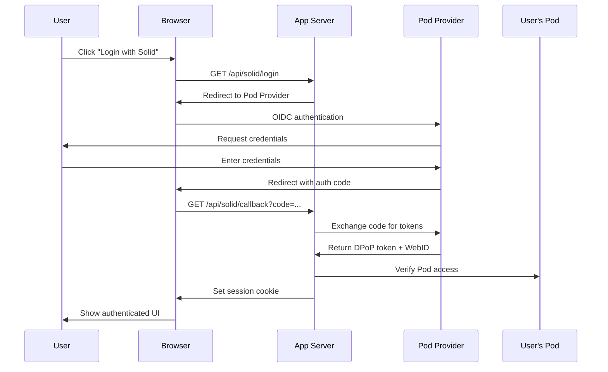

# Solid Project Integration Roadmap
## Location Tracker → User-Controlled Decentralized Data Storage

**Version:** 1.0
**Date:** 2025-11-12
**Status:** Proposal

---

## Executive Summary

This roadmap proposes integrating the Solid Project protocol into the Location Tracker application, transforming it from a centralized architecture to a user-controlled, decentralized data storage system. Users will authenticate using their Solid Pod (Personal Online Datastore) and maintain complete ownership and control over their location data, error logs, and personal information.

### Key Benefits

- **User Data Sovereignty**: Users own and control their data completely
- **Privacy by Design**: Data stored in user's personal Pods, not centralized servers
- **Interoperability**: Data accessible by multiple apps with user permission
- **Compliance**: Built-in GDPR, CCPA, and privacy regulation compliance
- **Portability**: Users can switch providers or apps without losing data
- **Granular Permissions**: Fine-grained access control per resource

---

## Current Architecture

### Existing System
- **Backend**: Go application with DynamoDB storage
- **Authentication**: Simple password-based session cookies
- **Data Storage**: Centralized in AWS DynamoDB tables
- **Data Types**: Locations, error logs, commercial real estate, tips, donations
- **Access Control**: Binary authenticated/unauthenticated

### Current Data Flow
```
User Browser → Location Tracker Server → DynamoDB
     ↑                                        ↓
     └────────────────────────────────────────┘
           (Server controls all data)
```

---

## Target Architecture (Solid-Enabled)

### Future System
- **Backend**: Go application as Solid-compatible middleware
- **Authentication**: Solid OpenID Connect (DPoP tokens)
- **Data Storage**: User's personal Solid Pods + optional server cache
- **Data Types**: Same, but stored as RDF Linked Data
- **Access Control**: User-controlled ACL per resource

### Future Data Flow
```
User Browser ←→ Solid Pod Provider (User's Data)
     ↓                    ↑
     ↓                    ↑
     └→ Location Tracker Server (Optional caching/aggregation)
           (User controls all data access)
```

---

## Phase 1: Foundation & Research (Weeks 1-4)

### Goals
- Understand Solid protocol specifications
- Set up development Solid Pod infrastructure
- Create proof-of-concept authentication

### Technical Tasks

#### 1.1 Environment Setup
- [ ] Register test Solid Pod accounts (inrupt.net, solidcommunity.net)
- [ ] Install Solid server locally for testing (Community Solid Server)
- [ ] Set up development SSL certificates for localhost HTTPS
- [ ] Review Solid specifications: Protocol, Authentication, WebID

#### 1.2 Authentication Research
- [ ] Study Solid OpenID Connect flow with DPoP
- [ ] Review `@inrupt/solid-client-authn-browser` library
- [ ] Review `@inrupt/solid-client-authn-node` library
- [ ] Test authentication flow with test Pod
- [ ] Document WebID profile structure

#### 1.3 Data Modeling Research
- [ ] Learn RDF, Turtle, and JSON-LD formats
- [ ] Study LDP (Linked Data Platform) containers
- [ ] Research appropriate vocabularies for location data (schema.org, geo)
- [ ] Define RDF schemas for: locations, error logs, tips
- [ ] Document container hierarchy for user data

#### 1.4 Proof of Concept
- [ ] Create simple HTML page with Solid login button
- [ ] Implement "Login with Solid" flow in browser
- [ ] Read user's WebID profile after authentication
- [ ] Write a test location data point to user's Pod
- [ ] Read back location data from Pod
- [ ] Display user's name from WebID profile

**Deliverables:**
- Technical specification document
- PoC demo application (separate repo)
- Data model RDF schemas (Turtle files)
- Authentication flow diagram

---

## Phase 2: Backend Integration (Weeks 5-10)

### Goals
- Add Solid authentication to Go backend
- Implement Pod read/write operations
- Maintain backward compatibility

### Technical Tasks

#### 2.1 Go Solid Client Library
- [ ] Research Go libraries for Solid (or use HTTP directly)
- [ ] Implement DPoP token validation in Go
- [ ] Create Go package for Solid Pod HTTP operations
- [ ] Implement RDF serialization/deserialization (Turtle/JSON-LD)
- [ ] Add comprehensive error handling

#### 2.2 Authentication Layer
- [ ] Add new `/api/solid/login` endpoint (initiates OIDC flow)
- [ ] Add `/api/solid/callback` endpoint (receives auth code)
- [ ] Validate DPoP tokens on protected endpoints
- [ ] Extract WebID from validated tokens
- [ ] Store session with WebID (not password)
- [ ] Implement logout and token refresh

#### 2.3 Dual-Mode Support
- [ ] Add `SOLID_ENABLED` environment flag
- [ ] Keep existing password auth as fallback
- [ ] Create abstraction layer for data storage:
  ```go
  type DataStore interface {
      SaveLocation(ctx, userID, location) error
      GetLocations(ctx, userID) ([]Location, error)
      SaveErrorLog(ctx, userID, errorLog) error
      GetErrorLogs(ctx, userID) ([]ErrorLog, error)
  }

  type DynamoDBStore struct { /* existing */ }
  type SolidPodStore struct { /* new */ }
  ```
- [ ] Route requests to appropriate storage based on auth method

#### 2.4 Pod Operations
- [ ] Implement write operations to user's Pod
- [ ] Implement read operations from user's Pod
- [ ] Create container structure in user's Pod on first login:
  ```
  /private/
    /location-tracker/
      /locations/
      /error-logs/
      /tips/
      /preferences.ttl
  ```
- [ ] Handle Pod unavailability gracefully
- [ ] Implement optional server-side caching

#### 2.5 RDF Data Transformation
- [ ] Create Go structs with RDF tags
- [ ] Implement Location → RDF Turtle conversion
- [ ] Implement ErrorLog → RDF Turtle conversion
- [ ] Implement RDF Turtle → Go struct parsing
- [ ] Use appropriate vocabularies (schema.org/Place, geo:, etc.)

**Deliverables:**
- Go Solid client package
- Updated backend with dual-mode authentication
- RDF serialization utilities
- Integration tests
- Updated API documentation

---

## Phase 3: Frontend Integration (Weeks 11-14)

### Goals
- Add Solid login UI
- Implement client-side Pod operations
- Maintain existing UX flow

### Technical Tasks

#### 3.1 Solid Authentication UI
- [ ] Add NPM package: `@inrupt/solid-client-authn-browser`
- [ ] Add "Login with Solid" button to login screen
- [ ] Implement Pod provider selection (inrupt.net, solidcommunity.net, custom)
- [ ] Handle OIDC redirect flow
- [ ] Store session in localStorage
- [ ] Add user profile display (name, avatar from WebID)
- [ ] Implement logout flow

#### 3.2 Client-Side Pod Operations
- [ ] Add NPM package: `@inrupt/solid-client`
- [ ] Implement direct Pod writes for location sharing
- [ ] Implement direct Pod reads for location display
- [ ] Add loading states for Pod operations
- [ ] Handle offline/Pod unavailable scenarios
- [ ] Implement optimistic UI updates

#### 3.3 User Settings
- [ ] Add settings page for Solid users
- [ ] Allow users to choose Pod vs Server storage
- [ ] Add data export functionality
- [ ] Add data deletion functionality
- [ ] Display current storage location
- [ ] Show Pod URL and permissions

#### 3.4 Access Control UI
- [ ] Show which apps have access to user's data
- [ ] Add UI to revoke app access
- [ ] Add UI to grant access to specific contacts
- [ ] Display WAC (Web Access Control) rules

**Deliverables:**
- Updated frontend with Solid authentication
- User settings interface
- Client-side Pod utilities (JavaScript)
- Updated user documentation

---

## Phase 4: Advanced Features (Weeks 15-20)

### Goals
- Implement social features using Solid
- Add data sharing between users
- Implement offline-first capabilities

### Technical Tasks

#### 4.1 Social Features
- [ ] Implement friend discovery via WebID
- [ ] Allow users to share location with specific friends
- [ ] Implement inbox notifications (LDN protocol)
- [ ] Add activity streams for location sharing
- [ ] Create group containers for shared data

#### 4.2 Data Sharing
- [ ] Implement ACL (Access Control List) editor
- [ ] Allow users to grant read access to specific resources
- [ ] Implement time-limited access grants
- [ ] Add audit log of access grants
- [ ] Create shareable links with embedded permissions

#### 4.3 Offline Support
- [ ] Implement service worker for offline access
- [ ] Add IndexedDB cache for Pod data
- [ ] Queue Pod writes when offline
- [ ] Sync when connection restored
- [ ] Show sync status in UI

#### 4.4 Multi-App Interoperability
- [ ] Document data shapes for other apps
- [ ] Register app in Solid app catalog
- [ ] Add "Open in other app" links
- [ ] Test interoperability with other Solid apps
- [ ] Create developer documentation

#### 4.5 Performance Optimization
- [ ] Implement caching strategies
- [ ] Add pagination for large datasets
- [ ] Use SPARQL queries for filtering
- [ ] Optimize RDF parsing
- [ ] Implement delta sync for updates

**Deliverables:**
- Social features implementation
- Offline-first capabilities
- Data sharing UI
- Performance benchmarks
- Interoperability test results

---

## Phase 5: Migration & Deployment (Weeks 21-24)

### Goals
- Migrate existing users to Solid
- Deploy production infrastructure
- Monitor and optimize

### Technical Tasks

#### 5.1 Data Migration Tools
- [ ] Create migration script: DynamoDB → Solid Pod
- [ ] Add bulk export from DynamoDB (Turtle format)
- [ ] Add bulk import to user's Pod
- [ ] Implement data validation
- [ ] Create migration status dashboard

#### 5.2 User Migration Flow
- [ ] Add "Upgrade to Solid" banner for existing users
- [ ] Create migration wizard UI
- [ ] Explain benefits of Solid to users
- [ ] Allow users to choose Pod provider
- [ ] Migrate data in background
- [ ] Verify data integrity
- [ ] Option to keep DynamoDB as backup

#### 5.3 Production Deployment
- [ ] Set up production Solid server (if self-hosting)
- [ ] Configure HTTPS/TLS properly
- [ ] Set up monitoring for Pod operations
- [ ] Add error tracking for Solid operations
- [ ] Create runbooks for common issues
- [ ] Set up backup strategy (if caching)

#### 5.4 Testing & QA
- [ ] End-to-end testing of all flows
- [ ] Load testing with multiple Pods
- [ ] Security audit of authentication
- [ ] Accessibility testing
- [ ] Cross-browser testing
- [ ] Mobile responsive testing

#### 5.5 Documentation
- [ ] User guide for Solid features
- [ ] FAQ for common questions
- [ ] Developer documentation
- [ ] API reference
- [ ] Video tutorials
- [ ] Migration guide

**Deliverables:**
- Migration tools
- Production deployment
- Comprehensive documentation
- User onboarding materials

---

## Technical Architecture Details

### Data Models in RDF

#### Location (Turtle Format)
```turtle
@prefix schema: <http://schema.org/> .
@prefix geo: <http://www.w3.org/2003/01/geo/wgs84_pos#> .
@prefix xsd: <http://www.w3.org/2001/XMLSchema#> .

<#location-2025-11-12T18:30:00Z>
    a schema:Place ;
    geo:lat "40.7128"^^xsd:decimal ;
    geo:long "-74.0060"^^xsd:decimal ;
    schema:geo [
        a schema:GeoCoordinates ;
        schema:latitude "40.7128" ;
        schema:longitude "-74.0060"
    ] ;
    schema:accuracy "10.5"^^xsd:decimal ;
    schema:dateCreated "2025-11-12T18:30:00Z"^^xsd:dateTime ;
    schema:device <#device-abc123> .
```

#### Error Log (JSON-LD Format)
```json
{
  "@context": {
    "@vocab": "http://schema.org/",
    "geo": "http://www.w3.org/2003/01/geo/wgs84_pos#"
  },
  "@type": "Report",
  "@id": "#error-log-2025-11-12T18:30:00Z",
  "name": "Application Error",
  "description": "Database connection timeout",
  "dateCreated": "2025-11-12T18:30:00Z",
  "associatedMedia": {
    "@type": "ImageObject",
    "contentUrl": "https://giphy.com/gifs/error-xyz"
  },
  "about": {
    "@type": "SoftwareApplication",
    "name": "Location Tracker"
  }
}
```

### Container Structure in Pod
```
/private/
  location-tracker/
    locations/
      2025/
        11/
          location-2025-11-12T18:30:00Z.ttl
          location-2025-11-12T19:45:00Z.ttl
    error-logs/
      2025/
        11/
          error-2025-11-12T18:30:00Z.jsonld
    preferences.ttl
    settings.jsonld

/public/
  location-tracker/
    shared-locations/
      [locations shared with others]
```

### Authentication Flow



### Permission Model

Users control access at multiple levels:
1. **Container Level**: `/private/location-tracker/` - only user
2. **Resource Level**: Specific location files - user + selected friends
3. **App Level**: Which apps can read/write their data
4. **Time-Limited**: Grant access that expires after N days

Example ACL (Access Control List):
```turtle
@prefix acl: <http://www.w3.org/ns/auth/acl#> .

<#owner>
    a acl:Authorization ;
    acl:agent <https://alice.solidcommunity.net/profile/card#me> ;
    acl:accessTo <./> ;
    acl:mode acl:Read, acl:Write, acl:Control .

<#appAccess>
    a acl:Authorization ;
    acl:origin <https://notspies.org> ;
    acl:accessTo <./> ;
    acl:mode acl:Read, acl:Write .

<#friendAccess>
    a acl:Authorization ;
    acl:agent <https://bob.solidcommunity.net/profile/card#me> ;
    acl:accessTo <./shared-locations/> ;
    acl:mode acl:Read .
```

---

## Technology Stack

### Frontend
- **Existing**: Vanilla JavaScript, HTML, CSS
- **New Libraries**:
  - `@inrupt/solid-client-authn-browser` (authentication)
  - `@inrupt/solid-client` (data operations)
  - `@inrupt/vocab-common-rdf` (RDF vocabularies)
  - Optional: `rdflib.js` (advanced RDF operations)

### Backend
- **Existing**: Go 1.21, AWS SDK
- **New Libraries**:
  - Custom HTTP client for Pod operations
  - RDF parsing library (e.g., `github.com/knakk/rdf`)
  - JWT validation library (for DPoP tokens)
  - Optional: SPARQL client for queries

### Infrastructure
- **Pod Provider Options**:
  1. **Use existing providers**: Inrupt, SolidCommunity.net
  2. **Self-host**: Community Solid Server (Node.js)
  3. **Hybrid**: Recommend public providers, offer self-hosting docs

- **Server Changes**: Minimal - mostly API additions
- **Database**: DynamoDB remains for caching, analytics, public data

---

## Migration Strategy

### Approach: Gradual Migration with Dual-Mode

1. **Week 1-4**: Existing users continue with password auth
2. **Week 5-8**: Add "Try Solid" beta program for volunteers
3. **Week 9-12**: Full Solid support, encourage migration
4. **Week 13-20**: Majority of users migrated
5. **Week 21+**: Legacy password auth remains but deprecated

### User Communication
- Email campaign explaining benefits
- In-app banners promoting Solid
- Video tutorials on setting up Pod
- FAQ addressing concerns
- Option to keep both auth methods

### Data Handling
- Users own their data from day one
- Server cache is temporary and user-controlled
- Clear data retention policies
- Export functionality for all users
- Delete functionality removes from server (but user keeps Pod data)

---

## Risk Assessment

### Technical Risks

| Risk | Probability | Impact | Mitigation |
|------|------------|--------|------------|
| Pod provider downtime | Medium | High | Implement offline-first, cache locally |
| Slow Pod operations | Medium | Medium | Server-side caching, optimize queries |
| Complex RDF learning curve | High | Medium | Provide utilities, abstract complexity |
| Browser compatibility | Low | Low | Use polyfills, graceful degradation |
| Data migration issues | Medium | High | Extensive testing, rollback plan |

### User Adoption Risks

| Risk | Probability | Impact | Mitigation |
|------|------------|--------|------------|
| Users don't understand Solid | High | High | Clear communication, tutorials |
| Users prefer simple password | Medium | Medium | Keep password auth as option |
| Pod signup friction | Medium | Medium | Recommend easy providers, guide through setup |
| Trust concerns | Low | Medium | Transparent about benefits, security audit |

### Business Risks

| Risk | Probability | Impact | Mitigation |
|------|------------|--------|------------|
| Increased development time | Medium | Medium | Phased approach, clear milestones |
| Higher initial costs | Low | Low | Use free Pod providers initially |
| Reduced analytics capability | Medium | Low | Request user permission for analytics |

---

## Success Metrics

### Technical Metrics
- 95%+ uptime for Pod operations
- <2s latency for Pod read/write
- 100% data integrity in migrations
- Zero critical security vulnerabilities
- 90%+ browser compatibility

### User Metrics
- 50%+ of users migrate to Solid in 6 months
- <5% churn during migration
- 4+ star average rating from Solid users
- <10% support tickets related to Solid

### Product Metrics
- 3+ interoperable apps accessing user data
- 20%+ users share data with friends
- 30%+ users appreciate data ownership (surveys)

---

## Cost Estimate

### Development Costs (assuming 1 full-stack developer)

| Phase | Duration | Effort | Est. Cost @ $150/hr |
|-------|----------|--------|---------------------|
| Phase 1: Research & PoC | 4 weeks | 160 hrs | $24,000 |
| Phase 2: Backend | 6 weeks | 240 hrs | $36,000 |
| Phase 3: Frontend | 4 weeks | 160 hrs | $24,000 |
| Phase 4: Advanced Features | 6 weeks | 240 hrs | $36,000 |
| Phase 5: Migration & Deploy | 4 weeks | 160 hrs | $24,000 |
| **Total** | **24 weeks** | **960 hrs** | **$144,000** |

### Infrastructure Costs

| Item | Monthly Cost | Notes |
|------|-------------|-------|
| Current AWS costs | ~$50 | Existing DynamoDB, EC2 |
| Pod hosting (self-hosted) | $20 | Optional, if self-hosting |
| Additional monitoring | $10 | Pod operations monitoring |
| SSL certificates | $0 | Let's Encrypt |
| **Total** | **~$80/mo** | Minimal increase |

### Alternative: Use Public Pod Providers
- **Infrastructure Cost**: $0 (users choose their providers)
- **Trade-off**: Less control, depend on external services

---

## Alternative Approaches

### 1. Hybrid: Solid + DynamoDB
- Keep DynamoDB for public/aggregated data
- Use Solid Pods only for personal data
- **Pros**: Best of both worlds, easier migration
- **Cons**: More complex architecture

### 2. Solid-First
- All data in Pods from day one
- Server is purely stateless middleware
- **Pros**: Maximum user control, true decentralization
- **Cons**: Performance challenges, higher complexity

### 3. Gradual: Start with Public Data
- Phase 1: Store only non-sensitive data in Pods
- Phase 2: Move sensitive data over time
- **Pros**: Lower risk, easier to test
- **Cons**: Slower to realize full benefits

**Recommendation**: Hybrid approach (Option 1) for best balance

---

## Future Opportunities

Once Solid integration is complete:

1. **Multi-App Ecosystem**
   - Location data accessible by maps apps
   - Error logs visible in debugging tools
   - Tips shared with review platforms

2. **Data Marketplace**
   - Users sell anonymized location data
   - Compensation for data sharing
   - Transparent terms

3. **Advanced Analytics**
   - User controls what analytics are collected
   - Federated learning on user devices
   - Privacy-preserving insights

4. **Enterprise Features**
   - Corporate Pods for team data
   - Compliance with data regulations
   - Audit trails

5. **Research Applications**
   - Academic research with user consent
   - Contribute to public datasets optionally
   - Participate in studies with compensation

---

## Conclusion

Integrating Solid Project into Location Tracker represents a significant architectural shift toward user-controlled data. While it requires substantial development effort, the benefits include:

- ✅ User data sovereignty and privacy
- ✅ Regulatory compliance by design
- ✅ Interoperability with other apps
- ✅ Competitive differentiation
- ✅ Future-proof architecture
- ✅ Ethical data practices

The phased approach allows gradual adoption while maintaining existing functionality, minimizing risk and ensuring user satisfaction throughout the transition.

**Next Steps:**
1. Review and approve roadmap
2. Allocate development resources
3. Begin Phase 1 research
4. Set up project tracking and milestones
5. Communicate vision to stakeholders

---

## References

### Solid Project
- Solid Specification: https://solidproject.org/TR/protocol
- Solid OIDC: https://solidproject.org/TR/oidc
- WebID Specification: https://www.w3.org/2005/Incubator/webid/spec/

### Libraries & Tools
- Inrupt JavaScript Client: https://github.com/inrupt/solid-client-js
- Authentication Library: https://github.com/inrupt/solid-client-authn-js
- Community Solid Server: https://github.com/CommunitySolidServer/CommunitySolidServer

### Learning Resources
- Solid Documentation: https://docs.inrupt.com/
- Solid Tutorial: https://solidproject.org/developers/tutorials/getting-started
- RDF Primer: https://www.w3.org/TR/rdf-primer/

### Pod Providers
- Inrupt PodSpaces: https://signup.pod.inrupt.com/
- SolidCommunity.net: https://solidcommunity.net/
- Solid Web: https://solidweb.me/

---

**Document Version**: 1.0
**Last Updated**: 2025-11-12
**Authors**: Claude Code
**Status**: Awaiting Approval
